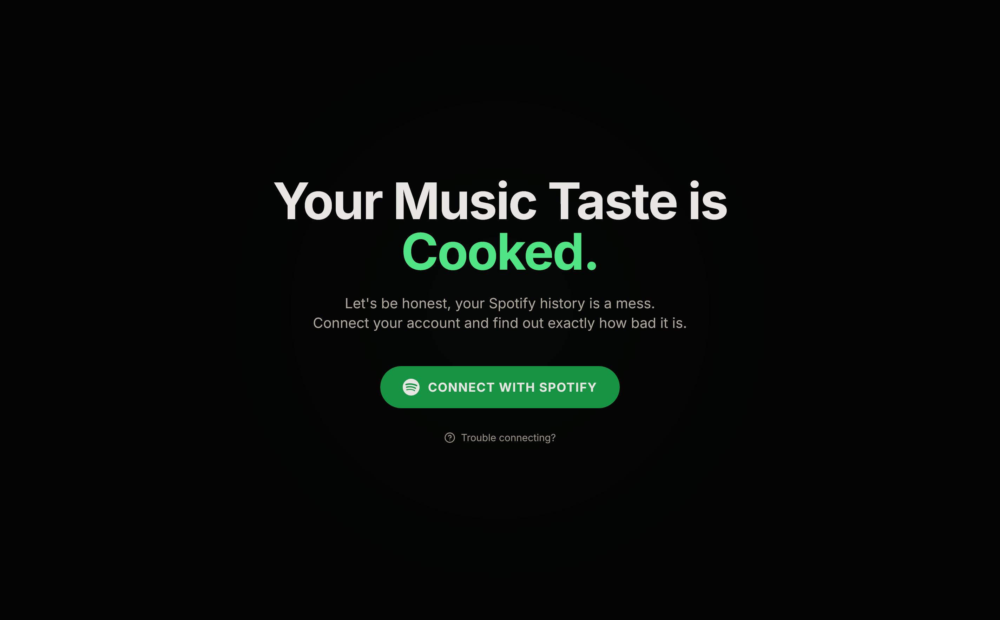
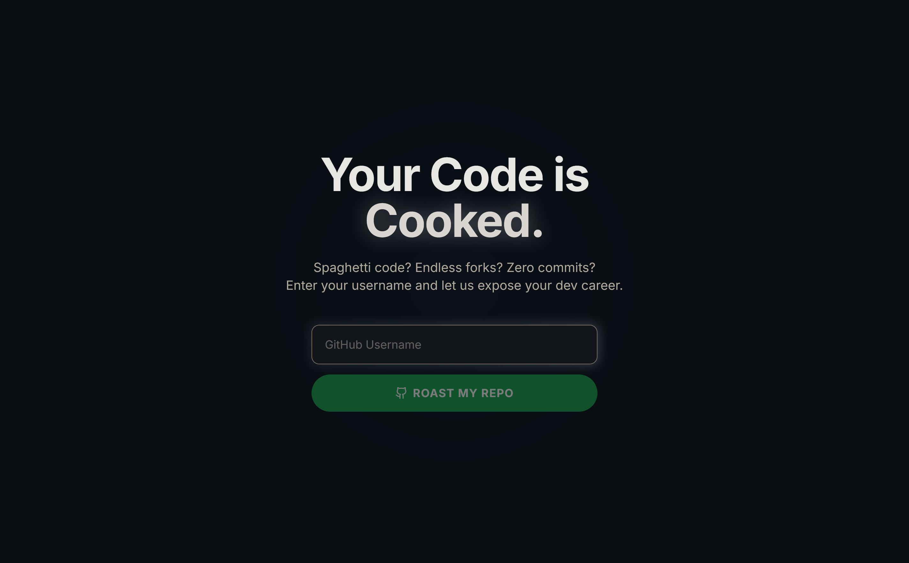
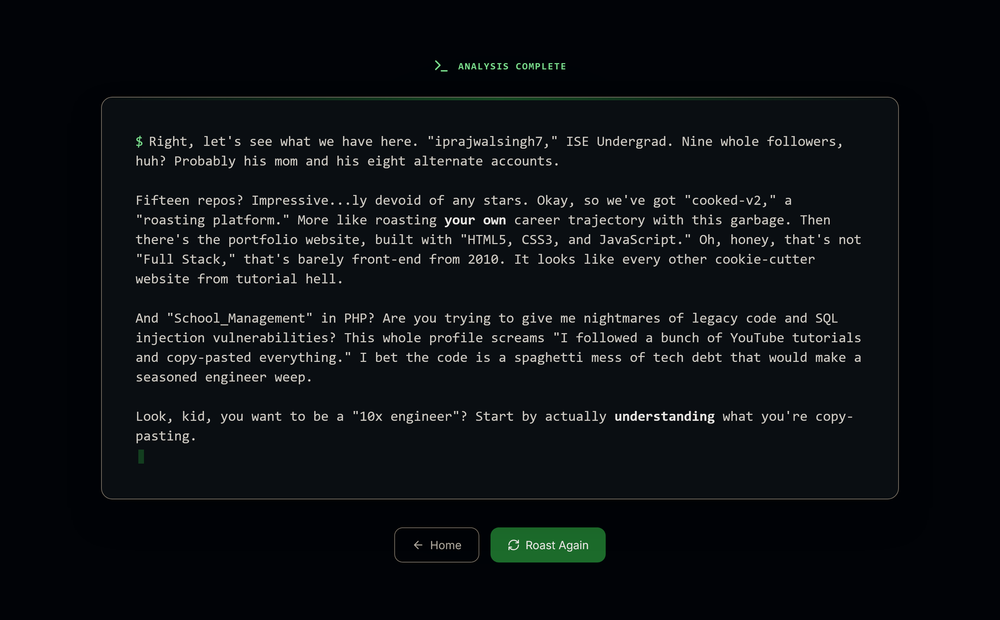

# Cooked V2 - The Ultimate Roast App 🍳🔥

**The evolution of [Cooked](https://github.com/iprajwalsingh7/cooked). Now roasting more than just your music taste.**

🔴 **Project is live [here](https://cooked-v2.vercel.app).**

Cooked V2 is a unified platform that uses Google Gemini AI to ruthlessly analyze and roast your digital existence across **Spotify**, **GitHub**, and **Reddit**.

## 🚀 What's New in V2?

This version is a complete rewrite and expansion of the original Spotify-only app.

*   **Unified Hub Architecture**: A central landing page to manage multiple roasting services.
*   **GitHub Roast**: Analyzes your repositories, commit history, and code quality to expose your "tutorial hell" projects and spaghetti code.
*   **Reddit Roast**: Digs through your comment history, karma obsession, and subreddit choices to call out your "chronically online" behavior.
*   **Enhanced AI Personas**:
    *   *Spotify*: Toxic Elitist Music Critic.
    *   *GitHub*: Toxic Senior Engineer.
    *   *Reddit*: Cynical Internet Troll.
*   **Better Error Handling**: Graceful handling of API rate limits with humorous messages.
*   **UI Standardization**: Consistent, premium dark-mode aesthetic across all platforms.

## 📸 Screenshots

<p align="center">
  
  
</p>
<p align="center">
  
  
</p>
<p align="center">
  
</p>

## ✨ Features

-   **Multi-Platform Support**: Spotify, GitHub, Reddit.
-   **Ruthless AI**: Prompts tuned for maximum emotional damage (while staying within safety guidelines).
-   **Markdown Parsing**: Roasts are beautifully formatted with bold emphasis.
-   **Responsive Design**: Fully optimized for mobile and desktop.
-   **Troubleshooting**: Built-in guides for Spotify API limitations.

## 🛠️ Tech Stack

-   **Framework**: Next.js 14 (App Router)
-   **Styling**: Tailwind CSS
-   **AI**: Google Generative AI (Gemini 2.0 Flash)
-   **Integrations**:
    -   Spotify Web API (OAuth 2.0)
    -   GitHub API (Octokit)
    -   Reddit API (Public JSON)
-   **Icons**: Lucide React

## 📦 Getting Started

### Prerequisites

-   Node.js installed
-   A Spotify Developer account
-   A Google Cloud project with the Generative Language API enabled (Gemini)
-   (Optional) A GitHub Personal Access Token for higher rate limits

### Installation

1.  Clone the repository:
    ```bash
    git clone https://github.com/iprajwalsingh7/cooked-v2-ultimate-roast.git
    cd cooked-v2-ultimate-roast
    ```

2.  Install dependencies:
    ```bash
    npm install
    ```

3.  Set up environment variables:
    Create a `.env.local` file in the root directory and add the following:
    ```env
    # Spotify Configuration
    SPOTIFY_CLIENT_ID=your_spotify_client_id
    SPOTIFY_CLIENT_SECRET=your_spotify_client_secret
    SPOTIFY_REDIRECT_URI=http://localhost:3000/api/auth/callback

    # Google Gemini AI
    GEMINI_API_KEY=your_gemini_api_key

    # GitHub (Optional, prevents rate limits)
    GITHUB_TOKEN=your_github_token
    ```

4.  Run the development server:
    ```bash
    npm run dev
    ```

5.  Open [http://localhost:3000](http://localhost:3000) in your browser.

## ⚠️ Important Note on Spotify API

Spotify's API requires apps to be in "Development Mode" unless they are approved for a quota extension (which requires 250k users).
**If you are not the developer, you cannot log in unless your email is manually added to the allowlist.**
Use the "Trouble connecting?" button on the Spotify page to request access.

## 👨‍💻 Crafted by Prajwal

Check out my portfolio: [iprajwalsingh7.dev](https://iprajwalsingh7.dev)

## 📄 License

This project is licensed under the MIT License.
