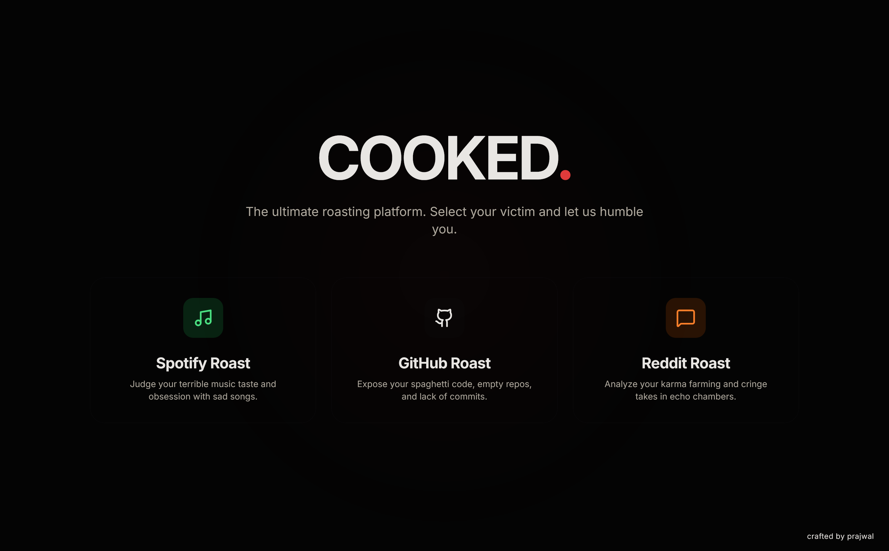
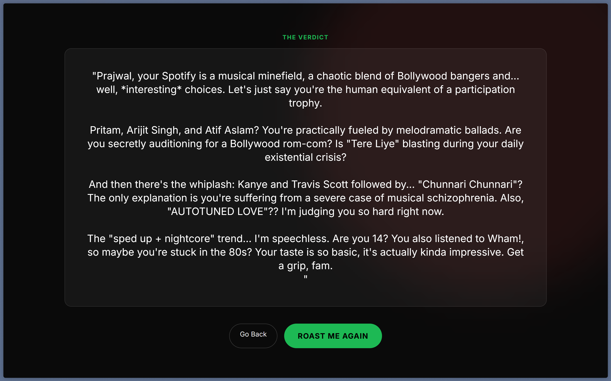

# Cooked - Spotify Roaster

A Next.js application that uses the Spotify API and Google Gemini AI to ruthlessly roast your music taste.



## Features

-   **Spotify Integration**: Securely connects to your Spotify account to analyze your top artists, tracks, and listening history.
-   **AI-Powered Roasts**: Uses Google's Gemini AI (specifically the `gemini-2.0-flash-lite-preview-02-05` model) to generate unique, witty, and personalized roasts.
-   **Modern UI**: A clean, dark-themed interface built with Tailwind CSS.

## Tech Stack

-   **Frontend**: Next.js 14, React, Tailwind CSS
-   **Backend**: Next.js API Routes
-   **AI**: Google Generative AI (Gemini)
-   **Auth**: Spotify OAuth 2.0

## Getting Started

### Prerequisites

-   Node.js installed
-   A Spotify Developer account
-   A Google Cloud project with the Generative Language API enabled

### Installation

1.  Clone the repository:
    ```bash
    git clone https://github.com/iprajwalsingh7/cooked.git
    cd cooked
    ```

2.  Install dependencies:
    ```bash
    npm install
    ```

3.  Set up environment variables:
    Create a `.env.local` file in the root directory and add the following:
    ```env
    SPOTIFY_CLIENT_ID=your_spotify_client_id
    SPOTIFY_CLIENT_SECRET=your_spotify_client_secret
    SPOTIFY_REDIRECT_URI=http://127.0.0.1:3000/api/auth/callback
    GEMINI_API_KEY=your_gemini_api_key
    JWT_SECRET=your_jwt_secret
    ```

4.  Run the development server:
    ```bash
    npm run dev
    ```

5.  Open [http://localhost:3000](http://localhost:3000) in your browser.

## Screenshots



## License

This project is licensed under the MIT License.
